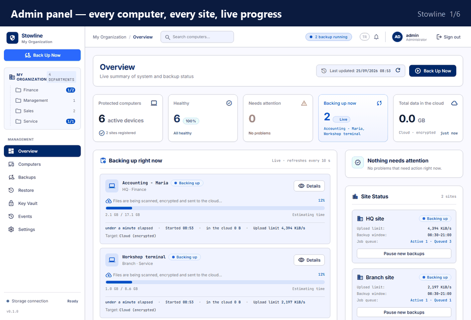
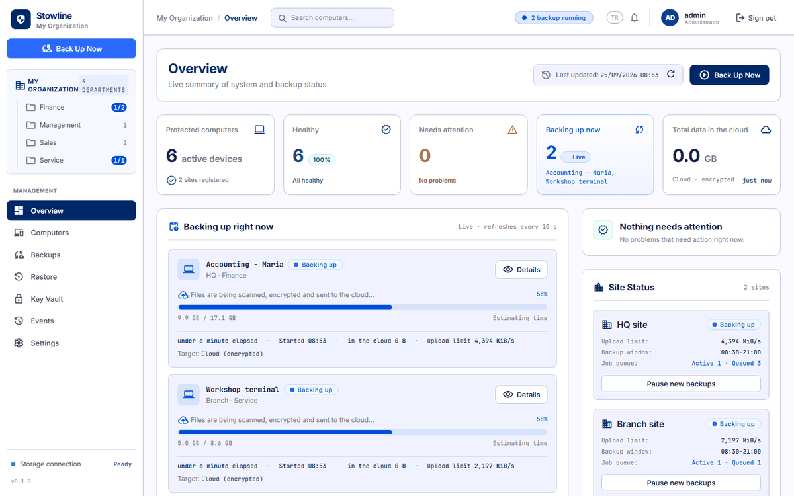
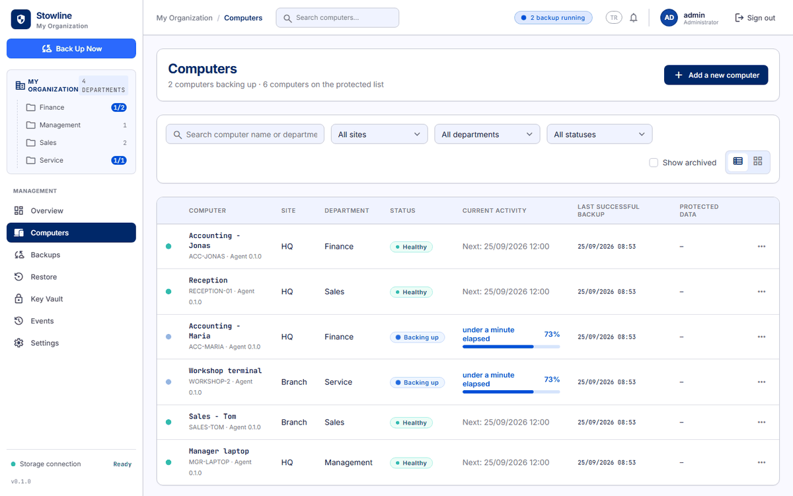
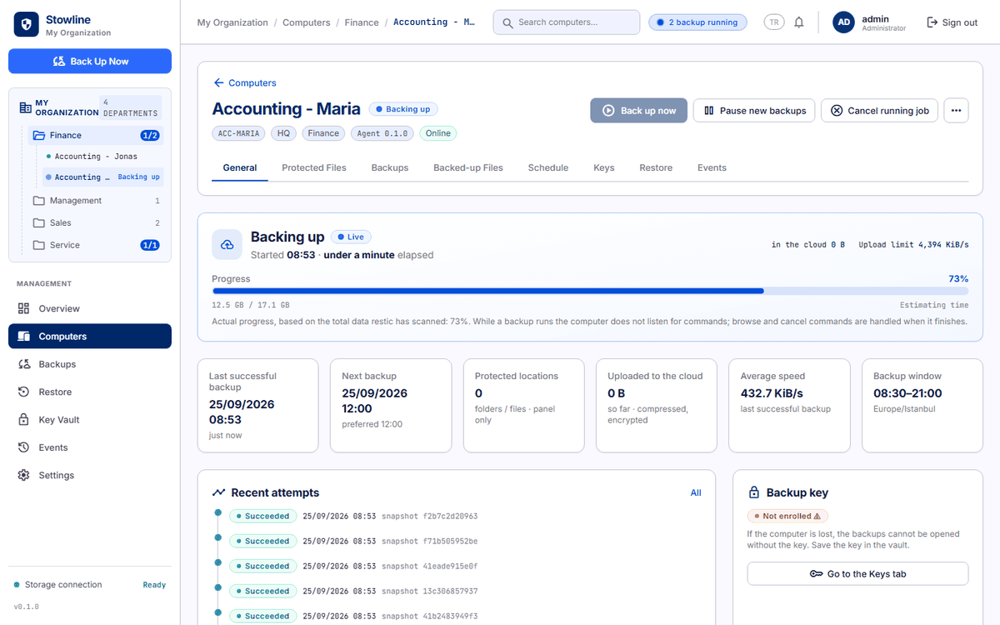
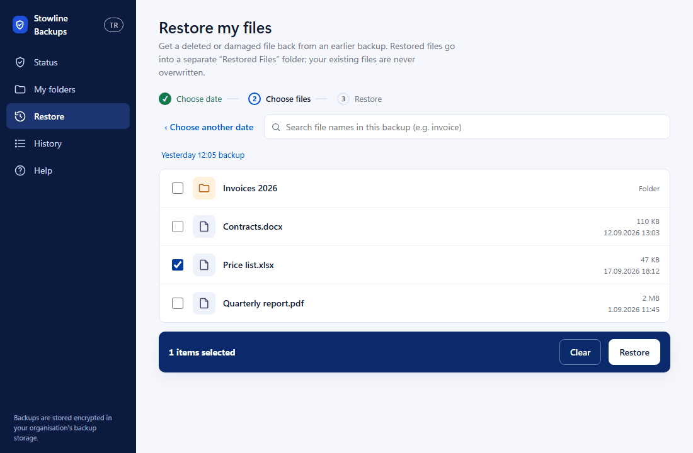
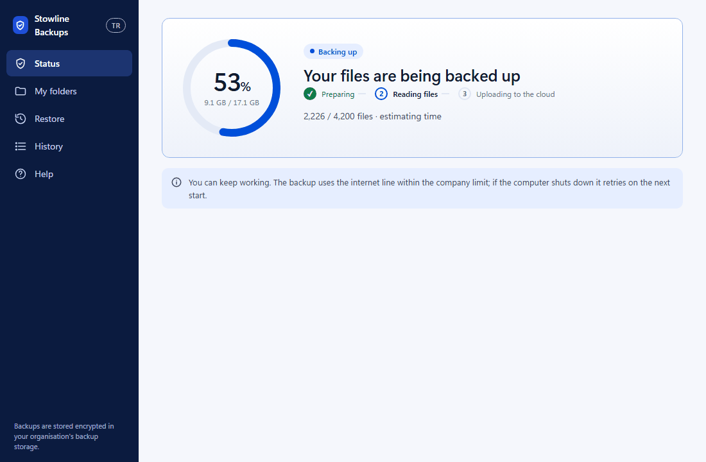
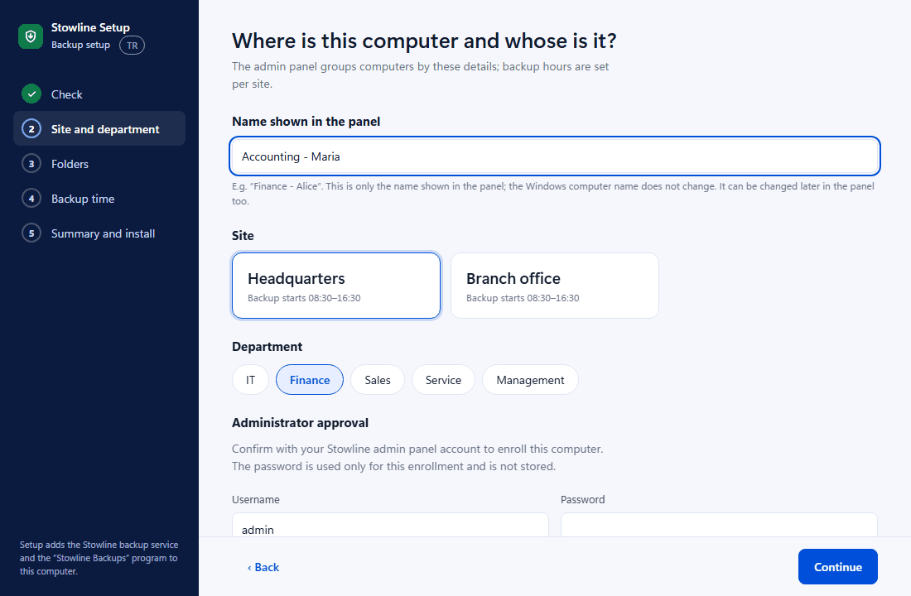

<p align="center">
  
</p>

<p align="center">
  <a href="../../releases/latest"></a>
  
  
  <a href="LICENSE"></a>
</p>

<p align="center"><b>English</b> · <a href="#türkçe">Türkçe</a></p>

Stowline backs up the work files of every Windows computer in your office — or several offices — to storage **you** control: Google Drive, S3, Backblaze B2, SFTP or anything else [rclone](https://rclone.org) speaks. Everything is encrypted on the PC with [restic](https://restic.net) before it leaves. One admin panel shows every computer and its live progress; people restore their own files without calling IT.

<p align="center">
  
</p>

**Try it in two minutes** — no Windows PCs, no storage account: a demo office with eight computers and live backups.

```bash
git clone https://github.com/canblmz1/stowline && cd stowline/deployments/demo
docker compose up -d        # then open http://localhost:8080 — admin / demo
```

It grew out of a real multi-site business with ordinary office PCs and thin internet lines, and ran there in production before being published.

## Why Stowline

|  |  |
|---|---|
| 🧩 **One file to install** | `Stowline Setup.exe`: type the server address, pick site and department, sign in as admin — done. It finds the work files (Desktop, Documents, Office files, Outlook PST), skips games, caches and credential files, and replaces an older install by itself. |
| 🚦 **Won't choke the office line** | Each site gets a measured upload speed and a budget (say 40 %). The server admits only as many simultaneous backups as fit, and the gateway caps the site's total. |
| 🔒 **Encrypted, no cloud keys on PCs** | restic encrypts on the PC. PCs only talk to your server; only the gateway holds the storage credentials, and each PC can reach only its own repository. |
| 📸 **Open files too** | Windows VSS snapshots, so open Outlook PSTs and Excel files are backed up consistently. |
| 🙋 **Self-service restore** | The *Stowline Backups* app shows live progress and lets users bring back any file from any day into a separate *Restored Files* folder — originals are never overwritten. |
| 🗝️ **Keys you won't lose** | Optional Key Vault on the server plus a tool to put each PC's key on paper / in a password manager. Without the key nobody — including you — can open a backup. |
| 🔄 **Updates itself** | New agent builds roll out over HTTPS, SHA-256 verified, only when no backup is running, with automatic rollback. |
| 🌍 **English & Türkçe** | Follows the browser / Windows language, with a one-click switch. |

## Get started in 3 steps

**1 · Run the server** (any Linux box with Docker and a domain name pointing at it)

```bash
git clone <this repository> && cd stowline/deployments/compose
cp .env.prod.example .env        # set your domain, passwords, storage
cp /path/to/rclone.conf .        # made with `rclone config`
docker compose -f docker-compose.prod.yml up -d
```

Caddy gets the HTTPS certificate on its own. Open `https://<your domain>`, sign in, and enter each site's upload speed under **Settings**. Details, and a plain systemd install without Docker: [docs/DEPLOYMENT.md](docs/DEPLOYMENT.md).

**2 · Download the installer** — `Stowline-Setup-<version>.exe` from the [latest release](../../releases/latest).

**3 · Run it on each PC** — it asks for your server address, then the site, department and folders; one click at the end starts the first backup.

> The installer is not code-signed, so Windows SmartScreen asks once: *More info → Run anyway*.

Just want to look around? Start the [demo](deployments/demo) (`docker compose up -d` in `deployments/demo`, then <http://localhost:8080>, admin / demo). It is a lab setup without HTTPS and with a known password — never for real data.

## A closer look

<table>
<tr>
<td width="50%"><br><sub><b>Overview</b> — who is backing up right now, site budgets, what needs attention.</sub></td>
<td width="50%"><br><sub><b>Computers</b> — every PC by site and department, live progress, last good backup.</sub></td>
</tr>
<tr>
<td><br><sub><b>One computer</b> — history, protected folders, file search across all backups, restore, backup key.</sub></td>
<td><br><sub><b>Stowline Backups</b> — pick a day, tick the files, get them back.</sub></td>
</tr>
<tr>
<td><br><sub><b>For the user</b> — their own backup, in plain words.</sub></td>
<td><br><sub><b>Setup</b> — site, department and a friendly name for the panel.</sub></td>
</tr>
</table>

## How it fits together

```
 Windows PCs                               Your server                          Your storage
 ┌───────────────────────┐   HTTPS   ┌──────────────────────────────┐   rclone   ┌───────────┐
 │ stowline-agent (svc)  ├──────────►│ Caddy (automatic HTTPS)      │───────────►│ Drive, S3,│
 │   restic + VSS        │           │  ├─ control plane + panel    │            │ B2, SFTP… │
 │ Stowline Backups app  │           │  │   (FastAPI, PostgreSQL)   │            └───────────┘
 └───────────────────────┘           │  └─ gateway (restic REST API)│
                                     └──────────────────────────────┘
```

More: [architecture and security model](docs/ARCHITECTURE.md).

## How it compares

Stowline is built for one situation: **many Windows office PCs, one or several sites with thin internet lines, backups going to cloud storage, and no IT person at every site.** For other situations another tool is often the better choice — and they are good tools.

|  | Stowline | UrBackup | Veeam Agent for Windows (Free) | Duplicati |
|---|---|---|---|---|
| Central panel for all PCs | ✅ | ✅ | ➖ standalone; central management needs Veeam Backup & Replication | ➖ one web UI per PC |
| Backs up to cloud storage (Drive, S3, B2…) | ✅ any rclone remote | ➖ to the server's disks | ➖ local disk, network share (OneDrive being retired) | ✅ |
| Upload budget per office line, backups queued to fit | ✅ per site | ➖ per client / global throttle | ➖ per PC throttle | ➖ per PC throttle |
| Storage credentials stay off the PCs | ✅ | ✅ | ➖ each PC holds its target's | ❌ each PC holds them |
| Users restore their own files | ✅ into a separate folder | ✅ | ✅ | ✅ |
| Open files (VSS) | ✅ | ✅ | ✅ | ✅ |
| Disk images / bare-metal restore | ❌ files only | ✅ | ✅ | ❌ |
| Mac / Linux computers | ❌ Windows only | ✅ | ➖ separate agents | ✅ |
| License | Apache 2.0 + Commons Clause | AGPL-3.0 | proprietary, free edition | MIT |

<sub>To the best of our knowledge as of September 2026 — corrections are welcome in an issue.</sub>

**Pick something else if** you need disk images or bare-metal recovery (UrBackup, Veeam), you back up Macs or Linux machines, or you have a single PC (restic itself, or a GUI like Backrest, is simpler).

## Building from source

Windows with Go 1.26+ and Python 3.12:

```powershell
.\scripts\build-release.ps1 -OutDir releases\build
.\scripts\fetch-pinned-binaries.ps1                     # restic + rclone, SHA-256 checked
python scripts\package-installer.py                     # generic installer (asks for the server)
python scripts\package-installer.py --server https://backup.example.com --sites sites.json   # or: server built in
```

Tests: `go test ./...`, `pytest server/tests gateway/tests tools/stowline-setup/tests`. Pushing a `v*` tag builds the installer and the container images and publishes a release ([release workflow](.github/workflows/release.yml)).

| Path | What |
|---|---|
| `agent/` | Windows agent (service), desktop apps, installer — Go |
| `server/` | Control plane and admin panel — Python (FastAPI) |
| `gateway/` | restic REST API over rclone, per-site bandwidth cap |
| `tools/stowline-setup/` | Setup wizard that runs during install |
| `recovery/` | Restore a repository copy without the server |
| `deployments/` | Docker Compose (production and lab), systemd + Caddy |
| `i18n/` | Turkish → English interface text |

## Author

Stowline was designed and built by **[@canblmz1](https://github.com/canblmz1)** — originally for the computers of a small multi-site office, then released for everyone.

## Status and support

Stowline is maintained in spare time. Bug reports and pull requests are welcome — see [CONTRIBUTING.md](CONTRIBUTING.md). Security issues: [SECURITY.md](SECURITY.md).

## License

**Apache License 2.0 with the Commons Clause** ([LICENSE](LICENSE)).

- ✅ Use it for free — at home, in a school, in a charity, **or in your company** to back up your own computers.
- ✅ Change it and share your changes.
- ❌ **Selling it is not allowed**: you may not sell Stowline or a product or service whose value comes mainly from it — including hosting it for others, or paid installation/support built on it.

This makes Stowline *source-available*, not OSI "open source". Third-party components keep their own licenses: [NOTICE.md](NOTICE.md).

---

## Türkçe

**Kuruluşunuzun Windows bilgisayarları için merkezi yönetilen, şifreli yedekleme — kendi sunucunuzda.**

Stowline, bir ofisteki (ya da birkaç şubedeki) her Windows bilgisayarın iş dosyalarını **sizin** kontrolünüzdeki depolamaya — Google Drive, S3, Backblaze B2, SFTP ya da [rclone](https://rclone.org)'un desteklediği herhangi bir yer — yedekler. Her şey bilgisayardan çıkmadan önce [restic](https://restic.net) ile şifrelenir. Tek bir yönetim paneli her bilgisayarı ve canlı ilerlemesini gösterir; kullanıcılar dosyalarını IT'yi aramadan kendileri geri yükler.

Sıradan ofis bilgisayarları ve kısıtlı internet hatları olan, birden çok şubeli gerçek bir işletmede ortaya çıktı ve yayınlanmadan önce orada canlıda çalıştı.

**Neler yapar:**
- 🧩 **Tek dosyalık kurulum** — sunucu adresini yazın, şube ve departmanı seçin, yönetici olarak giriş yapın. İş dosyalarını kendisi bulur; oyunları, önbellekleri ve şifre/anahtar dosyalarını dışarıda bırakır; eski kurulumu kendisi kaldırır.
- 🚦 **Ofis hattını tıkamaz** — her şubenin ölçülmüş hızı ve bütçesi (ör. %40) vardır; aynı anda yalnızca sığacak kadar yedek çalışır.
- 🔒 **Şifreli, bilgisayarlarda bulut şifresi yok** — depolama bilgileri yalnızca sunucudaki gateway'dedir; her bilgisayar yalnızca kendi deposuna erişir.
- 📸 **Açık dosyalar da** — VSS sayesinde açık Outlook PST ve Excel dosyaları tutarlı yedeklenir.
- 🙋 **Kendi kendine geri yükleme** — *Stowline Backups* uygulaması canlı yüzdeyi gösterir; herhangi bir günden dosyaları ayrı bir *Geri Yüklenenler* klasörüne getirir, orijinallere asla dokunmaz.
- 🗝️ **Kaybolmayan anahtarlar** — sunucuda isteğe bağlı Şifre Kasası ve anahtarı kâğıda / parola yöneticisine almak için bir araç.
- 🔄 **Kendini günceller** — yeni sürümler HTTPS üzerinden, SHA-256 doğrulamasıyla, yedekleme yokken yüklenir; sorun olursa geri döner.
- 🌍 **Türkçe ve İngilizce** arayüz.

**İki dakikada deneyin** — Windows bilgisayar ya da depolama hesabı gerekmez; sekiz bilgisayarlı, canlı yedekleme yapan bir demo ofis açılır:

```bash
git clone https://github.com/canblmz1/stowline && cd stowline/deployments/demo
docker compose up -d        # sonra http://localhost:8080 — admin / demo
```

**Diğerlerinden farkı:** UrBackup, Veeam Agent ve Duplicati iyi araçlar. Stowline'ı ayıran şey birden çok şubede, zayıf internet hatlarında çalışan çok sayıda Windows bilgisayarı buluta yedeklemek için yapılmış olması: şube başına upload bütçesi ve sıraya alma, bilgisayarlarda bulut şifresi olmaması, çalışanın dosyasını kendisinin geri yüklemesi. Disk imajı/bare-metal geri yükleme ve Mac/Linux desteği **yoktur**; bunlar gerekiyorsa UrBackup ya da Veeam daha uygun. Ayrıntılı tablo: [How it compares](#how-it-compares).

**3 adımda kurulum:**
1. **Sunucu:** Docker kurulu bir Linux sunucuda `deployments/compose` klasöründe `.env` dosyasını doldurup `docker compose -f docker-compose.prod.yml up -d` (ayrıntılar: [docs/DEPLOYMENT.md](docs/DEPLOYMENT.md)).
2. **İndir:** [Son sürümden](../../releases/latest) `Stowline-Setup-<sürüm>.exe`.
3. **Her bilgisayarda çalıştır:** sunucu adresini, şubeyi, departmanı ve klasörleri sorar; sondaki tek tıkla ilk yedek başlar.

**Geliştiren:** [@canblmz1](https://github.com/canblmz1) — fikir ve tasarım.

**Lisans:** Apache 2.0 + Commons Clause. Ücretsiz kullanabilirsiniz — evde, okulda, dernekte **ya da şirketinizin kendi bilgisayarlarını yedeklemek için**. Değiştirip paylaşabilirsiniz. **Satmak yasaktır:** Stowline'ı ya da değeri esas olarak ondan gelen bir ürün/hizmeti (başkalarına barındırma, ücretli kurulum/destek dahil) satamazsınız.
